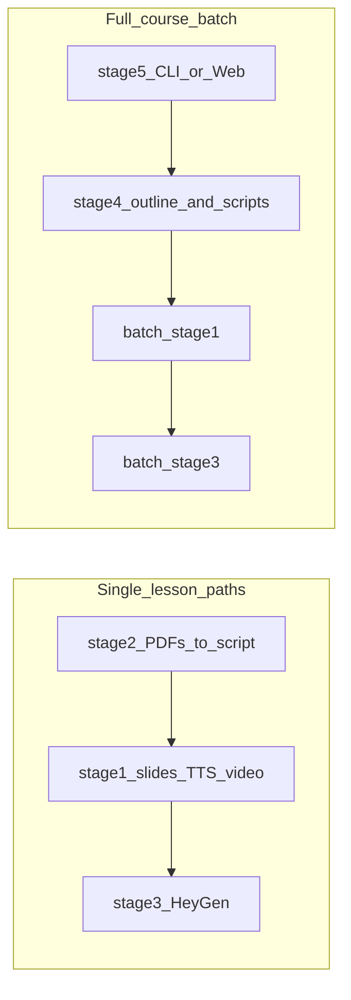

# Udemy Course Generator

Turn PDFs and structured scripts into slide-based lesson videos, with optional HeyGen talking-head avatars. The pipeline is split into **five stages** (folders `stage1`–`stage5`): extract and script with OpenAI, render slides and TTS, optionally generate avatar video, and orchestrate full courses or a batch web UI.

## Named stages

| Stage | Folder | Name | Role |
| ----- | ------ | ---- | ---- |
| 1 | `stage1` | **Slide & voice render** | Single lesson: `script.json` → slides (LibreOffice + PyMuPDF) → OpenAI TTS → FFmpeg → `output.mp4`. Entry: `make_video.py`. |
| 2 | `stage2` | **PDF library → one script** | Folder of PDFs → `output/extracted/` + `output/script.json` (PyMuPDF + OpenAI). Entry: `run_stage2.py`. |
| 3 | `stage3` | **Avatar video (HeyGen)** | Talking-head MP4 from slide images + narration via HeyGen. Entry: `run_stage3.py`. |
| 4 | `stage4` | **Full course from one PDF** | One PDF → course outline and 20 lesson folders `m##_v##/` with `script.json`; `batch_stage1.py` / `batch_stage3.py` call stages 1 and 3. Entry: `run_stage4.py`. |
| 5 | `stage5` | **Batch orchestration / web UI** | Full run: stage 4 → batch stage 1 → batch stage 3. CLI: `run_stage5.py`. Web: FastAPI `app.py` + `pipeline.py`. |

### Flow (full course)



## Prerequisites

- **Python 3.10+** (adjust if your environment differs).
- Per-stage dependencies: `pip install -r requirements.txt` inside each `stageN` you use.
- **LibreOffice** (headless) on PATH, or set `LIBREOFFICE_SOFFICE` in `stage1/.env` to `soffice.exe`.
- **ffmpeg** on PATH (for stage 1 compositing).
- **OpenAI** API key for scripting and TTS where used.
- **HeyGen** API key for stage 3 / batch avatar videos (paid usage).

## Configuration

1. Copy the `.env.example` in each stage you use to `.env` in the **same** folder.
2. Fill in real keys. Save as **UTF-8 without BOM** (Windows Notepad can add BOM and break parsing).
3. **Never commit `.env`** — it is listed in `.gitignore`. Only `.env.example` belongs in Git.

| Stage | Example file | Main variables |
| ----- | ------------ | ---------------- |
| 1 | `stage1/.env.example` | `OPENAI_API_KEY`, optional `LIBREOFFICE_SOFFICE` |
| 2 | `stage2/.env.example` | `OPENAI_API_KEY` (or rely on `stage1/.env`) |
| 3 | `stage3/.env.example` | `HEYGEN_API_KEY`, optional avatar/voice/timeouts |
| 4 | `stage4/.env.example` | `OPENAI_API_KEY` (or use `stage1/.env`) |

Stage 3 also reads `stage3/.env` and may fall back to `stage2/.env` for discovery in some setups; see `run_stage3.py` for details.

## Quick start

**Smoke-test stage 1 (no API spend for slides/FFmpeg tests):**

```bash
cd stage1
pip install -r requirements.txt
python make_video.py --test-slides
```

**TTS test (needs `OPENAI_API_KEY` in `stage1/.env`):**

```bash
python make_video.py --test-audio
```

**Full-course batch without HeyGen (OpenAI + LibreOffice + ffmpeg only):**

```bash
cd stage5
pip install -r requirements.txt
python run_stage5.py --no-heygen --course-title "Your course" --pdf "C:\path\to\book.pdf"
```

**Web UI (from repo root):**

```bash
cd stage5
pip install -r requirements.txt
uvicorn app:app --host 127.0.0.1 --port 8755
```

Open `http://127.0.0.1:8755/`. Keep API keys only in server-side `.env` files, not in the browser.

## Repository layout

- `stage1`–`stage5` — code and per-stage `requirements.txt`.
- `**/input/` — place your PDFs here locally; **`*.pdf` under `input/` is gitignored** to avoid committing copyrighted books.
- `**/output/` — generated extracts, scripts, videos, audio; **gitignored**.

## Security and publishing

- Before sharing this repo or opening a pull request, confirm **no real keys** are in tracked files: e.g. `git grep -i sk-` or search for `OPENAI_API_KEY=` / `HEYGEN_API_KEY=` after staging.
- If `.env` files with real keys ever touched a copy that was shared or logged, **rotate** those keys in the [OpenAI](https://platform.openai.com/api-keys) and HeyGen dashboards and update your local `.env` only.

## UI design notes

For customizing the stage 5 web template, see [stage5/DESIGN_HANDOFF.md](stage5/DESIGN_HANDOFF.md) and [stage5/CLAUDE_DESIGN_PROMPT.md](stage5/CLAUDE_DESIGN_PROMPT.md).

## License

No license file is included in this repository yet; add one if you publish publicly.
